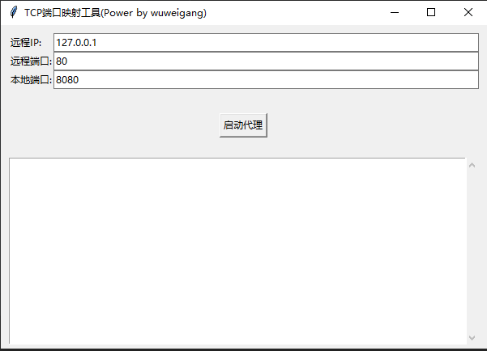

## 反向代理

依赖
pip install pystray psutil pillow nuitka

代码编译
nuitka --standalone --onefile  --show-memory --disable-ccache  .\proxy.py   
nuitka --standalone --onefile --enable-plugin=tk-inter --include-module=psutil --enable-plugin=multiprocessing --disable-console --show-memory --disable-ccache  .\ui.py